# TCDM Interconnect Overview

The `tcdm_interconnect` module provides three different low-latency interconnect topologies for architectures like the PULP-cluster, where we would like to route single cycle transactions from N master agents (cores) to M slaves (memory banks). We refer to such an interconnect parameterisation as an N x M instance in the following. This setting has a couple of constraints which makes interconnect design challenging. In particular, arbitration and routing has to be performed within one cycle (fully combinatorially), and therefore only simple and local arbitration/routing decisions can be taken.

This readme describes the available networks in detail, and summarizes the results of a parametric design space exploration of instances ranging from 8 x 8 to 256 x 1024.

Note that this subfolder also contains the `amo_shim.sv` module which can be used to add support for RISC-V atomics to the TCDM. This module essentially wraps each TCDM bank, and executes atomics and memory reservations locally at the memory side.

## Architectures

Each network has a request network that arbitrates among all requests and routes the request from the master agent to the correct slave, and a response network that routes the response back from the slave to the correct master.
All network architectures below have in common that they assume a fixed response latency (typically 1 clock cycle for TCDM using single-port SRAM cuts). This allows to simplify the response network, since the routing/arbitration decision computed in the request netowork can be delayed by a fixed amount and then to route the response back to the correct master.

### Full Crossbar (Xbar, Logarithmic Interconnect)

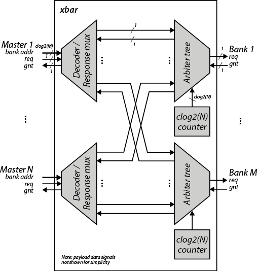

This is the main building block of all network topologies, and is typically used to implement the TCDM interconnect in smaller PULP systems. Arbitration is performed using an internal round robin counter, but the arbitration bits can also be supplied externally if needed (e.g. to make sure all arbiters use fixed prio, or operate in lockstep). Combinational delay is essentially O(log2(N)) and complexity grows as O(N2), which is one of the drawbacks of this architecture. The implementation allows any combination of NxM and is not restricted to N, M being a power of two.

### Clos Network

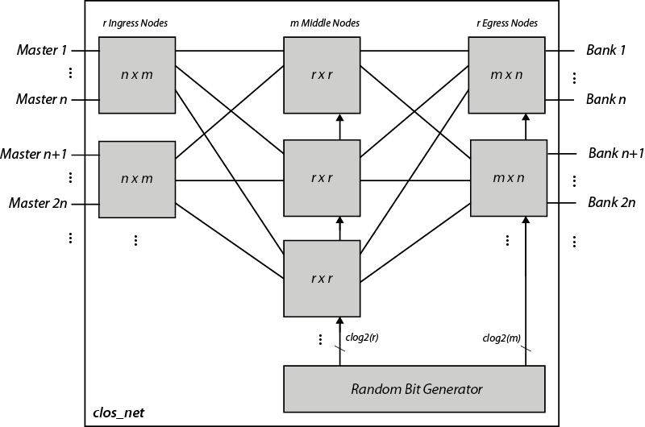

Clos networks consist of three distinct stages (ingress, middle, egress) as illustrated above. Each stage contains a set of nodes or switch boxes, which are implemented using the `xbar` module. Note that the parameters r, n, m are Clos parameters and typically different from N, M. All parameters have to be aligned to powers of two to simplify slicing of addresses. The parameters are chosen optimally in order to minimize implementation complexity (the implementation uses a precomputed LUT in order to determine  r, n, m). In terms of complexity, the Clos network scales with O(sqrt(N3)).

Clos networks have the nice theoretical property that if m=2n, the network is non-blocking, and if m=n the network is rearrangeably non-blocking - meaning that with an optimal route selection algorithm no conflicts arise. Unfortunately it is difficult to make such a decision within a single cycle combinatorially, as we would need to gather request information globally in order to perform route selection in the ingress nodes - which is undesirable in terms of delay. Hence we have to resort to simple local route selection and arbitration mechanisms. 

The currently implemented solution employs pseudo random bits to resolve arbitration conflicts in the middle and egress nodes, and a broadcast mechanism in combination with round robin arbitration in the ingress nodes. 

The random bits are generated using a pseudo random sequence from a 64bit LFSR that has additionally been fed through a few substitution/permutation rounds of the PRESENT block cipher in order to break linear shifting patterns.

The broadcast mechanism in the ingress nodes basically disables address decoding and sends the request of a particular master port to all of the m utput ports of a particular ingress node, where the local arbiters decide whether the request is forwarded to the middle nodes.

If a network has a banking factor b>1, the ingress nodes have only n/b input ports.

### Butterfly

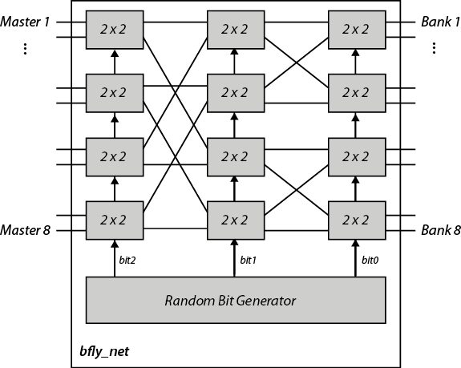

Butterfly networks consist of clog2(M) stages with switchboxes (implemented with the `xbar` module) with a certain radix (e.g. 2x2 or 4x4). The above figure illustrates an 8x8 radix-2 butterfly. The wiring between two stages has a wiring offset equal to the significance / weight of the corresponding address bit. The butterfly has acombinational delay O(log2(N)) and complexity grows as O(N log2(N)).

In order to avoid any correlation of the request patterns and the arbitration mechanism, we use a long pseudo random sequence to steer the arbitration trees within the switchboxes. The random numbers are generated in the same way as for Clos networks.

The butterfly implementation has a parameter that allows to instantiate multiple parallel butterfly networks. For instance, if this parameter is set to two for a 8x8 network, two parallel 4x8 butterflies are instantiated in combination with eight 2x1 crossbars in order to connect all eight masters to the eight banks. Hence, this parameters allows to trade off network complexity versus performance by allowing part of the network to be implemented with the more efficient butterfly, and the other part with a full crossbar. 

If a butterfly network has a banking factor b>1, some of the input ports are tied off. The input-to-switchbox assignment is performed in a way that makes the first network stages collision free.

## Design Space Exploration

The design space exploration framework is automated and parallelized using a makefile flow as described in more detail in [this readme](../../tb/tb_tcdm_interconnect/README.md). Below is an overview of a recent exploration run of network configurations ranging from 8 x 8 to 256 x 1024 in FDX 22 technology.

### Traffic Simulations

We assess the quality of service (QoS) as average grant probability (#number of grants per master divided by #cycles where a master asserts the request). The traffic simulation encompasses several synthetic benchmarks like random uniform patterns, permutations and linear bursts with random offset and length.

#### Clos

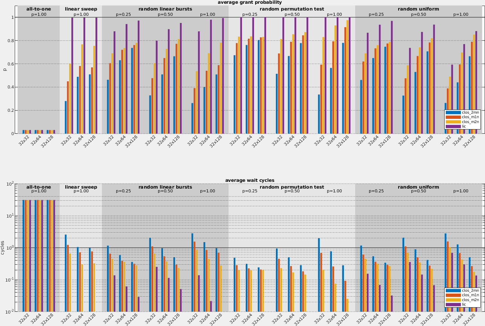

#### Butterfly's
##### 8x Master Ports
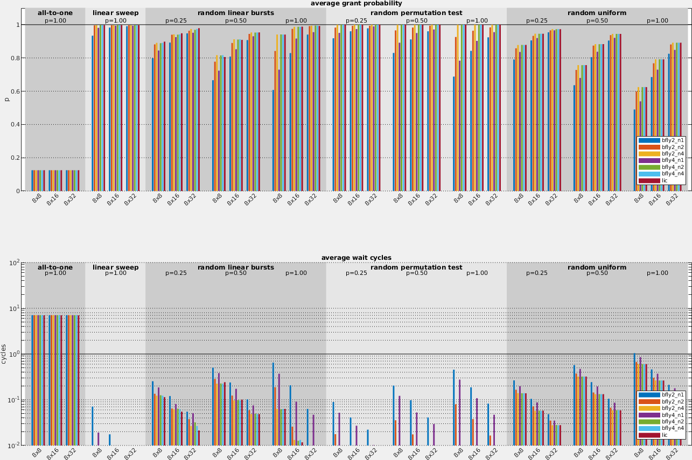
##### 16x Master Ports
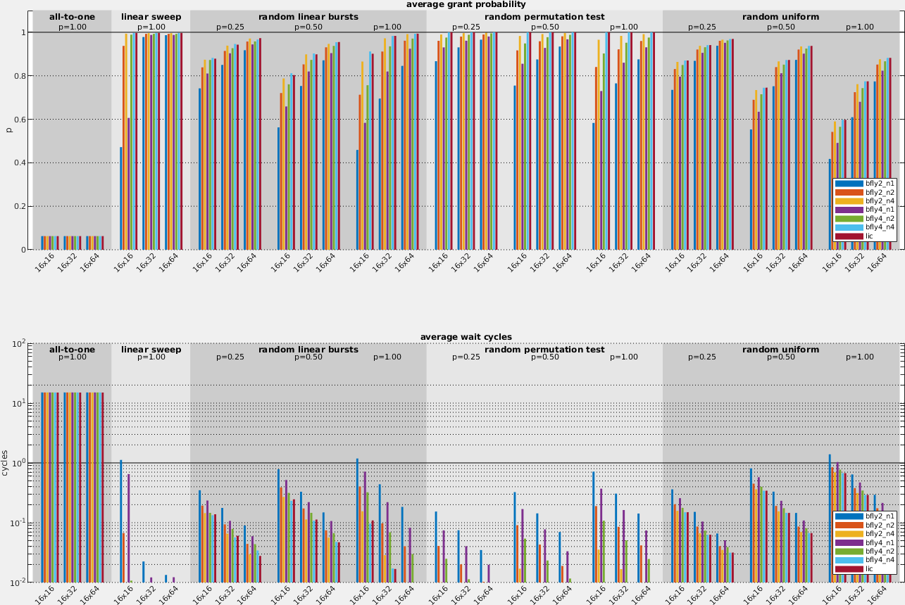
##### 32x Master Ports
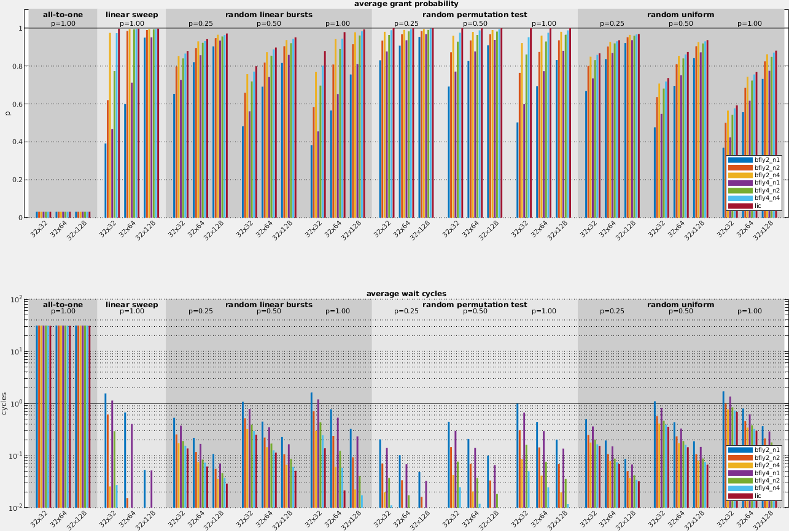
##### 64x Master Ports
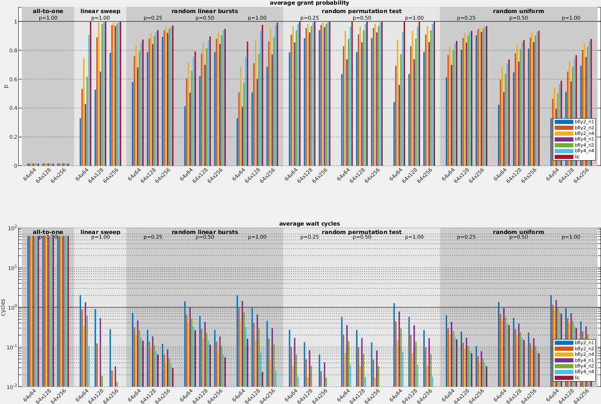
##### 128x Master Ports
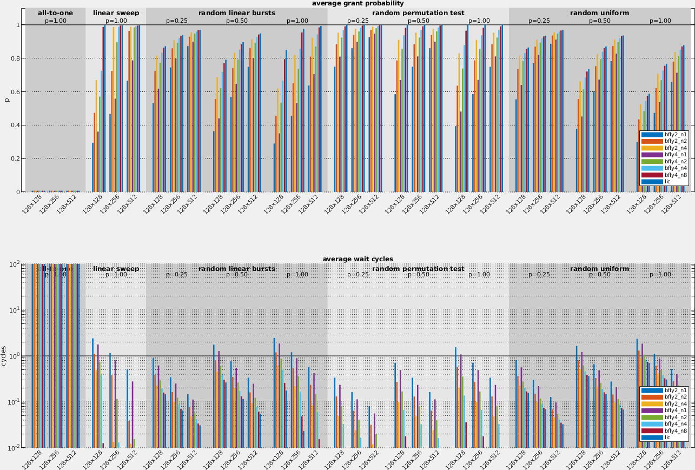
##### 256x Master Ports
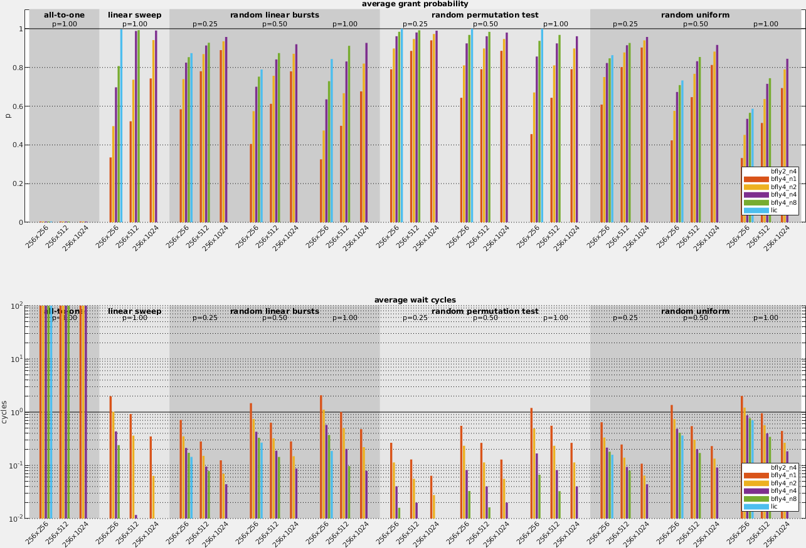

### Pareto Analysis

In order to assess the implementation complexities, the network configurations considered have been synthesized with Synopsys DC in FDX22 HP SS with no body biasing (1 GHz timing constraint). Note that this is only an approximation and an additional P&R step is needed to gauge the routability of the designs.

The implemetnation complexities and QoS results (as shown above) can then be cast into a Pareto analysis. Note that we are generally interested in comparing different networks that connect N cores to a certain amount of memory (e.g., 64kB), but the number of banks should not be fixed and is part of the analysis. Hence we plot all networks with the same amount of master agents together in one Pareto plot.

Main takeaways: 

- In general we can see that radix-4 networks with 1-4 parallel layers are often preferrable, both in terms of complexity and QoS.
- radix-2 butterflies are always dominated by radix-4 butterflies. This can also be shown analytically by assuming a quadratic cost for the switchboxes. It follows that radix-2 butterflies have the same complexity as the equivalent radix-4 butterflies, but since radix-4 butterflies always offer better QoS due to fewer in-network collisions, they are preferable over radix-2 butterflies.
- The analyzed Clos configurations are inferior to the lic and butterfly networks in most cases. Maybe a better routing strategy improves this situation.
- The lic is at the Pareto front for small configurations with 8 master ports, but for larger instances it becomes prohibitive and even infeasible in terms of complexity.
- The lic typically offers the best QoS best for linear patterns.

Note that the standard crossbar configuration with a banking factor of 2 is highlighted with bold green in each plot for reference. Instances that do not meet timing are highlighted with bold red.

#### Random Uniform Traffic

##### 8x Master Ports
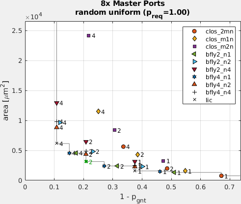
##### 16x Master Ports
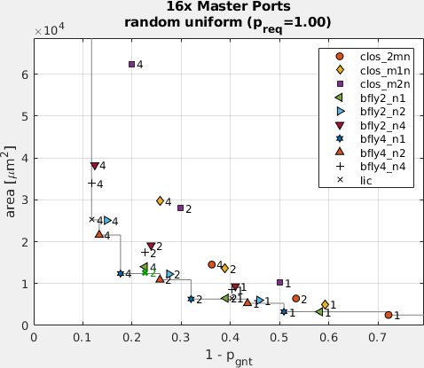
##### 32x Master Ports
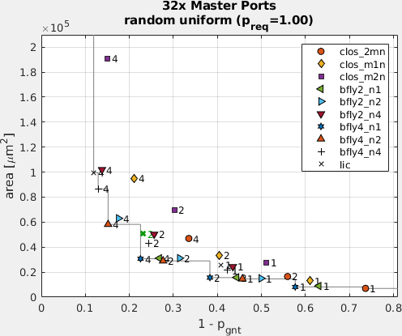
##### 64x Master Ports
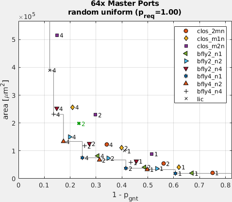
##### 128x Master Ports
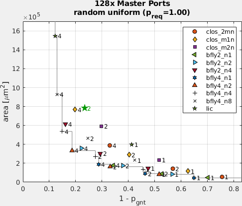
##### 256x Master Ports
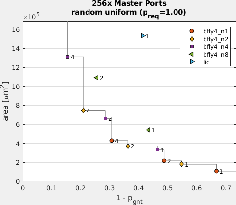

#### Random Linear Traffic
##### 8x Master Ports
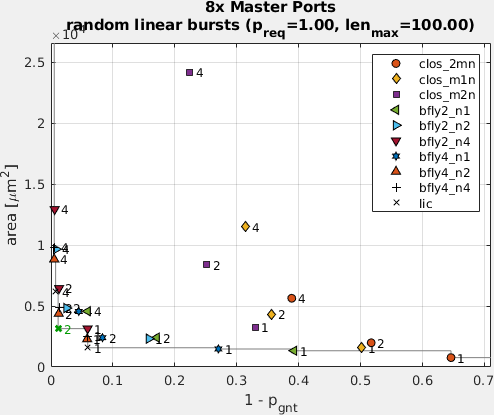
##### 16x Master Ports
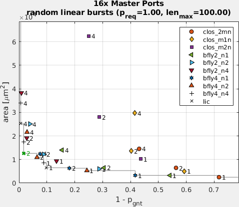
##### 32x Master Ports
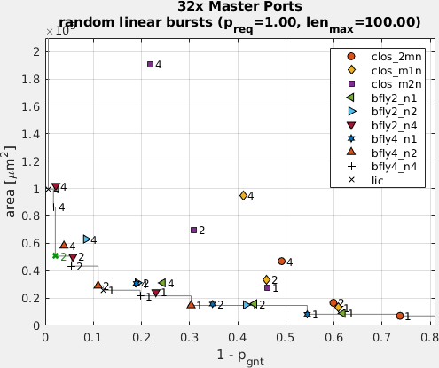
##### 64x Master Ports
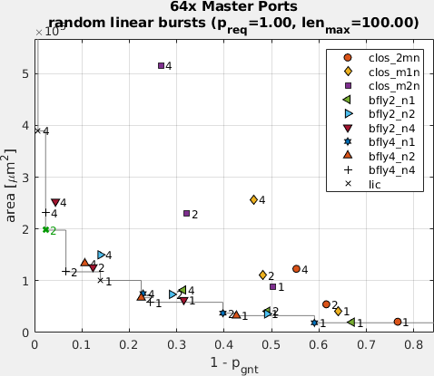
##### 128x Master Ports
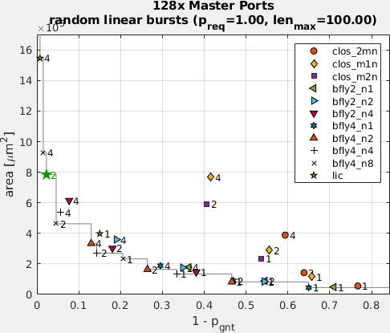
##### 256x Master Ports
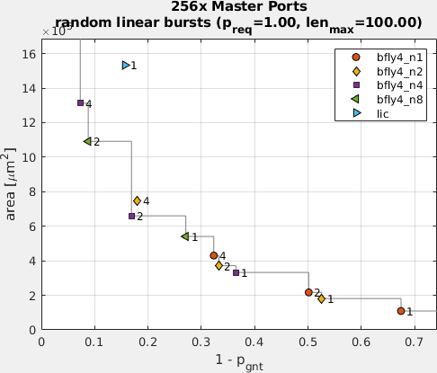

### Scalability Analysis

The plots below compare how the different network architectures scale in terms of #masters versus implementation complexity. 

#### Banking Factor 1
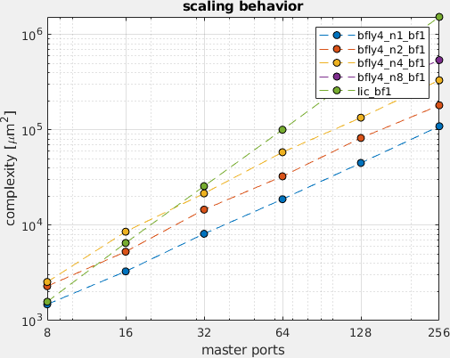
#### Banking Factor 2
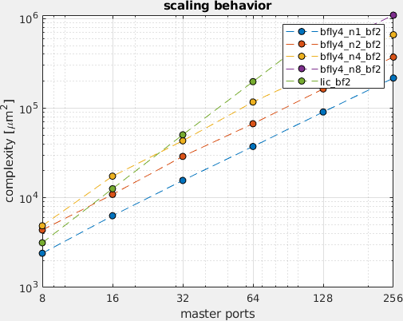
#### Banking Factor 4
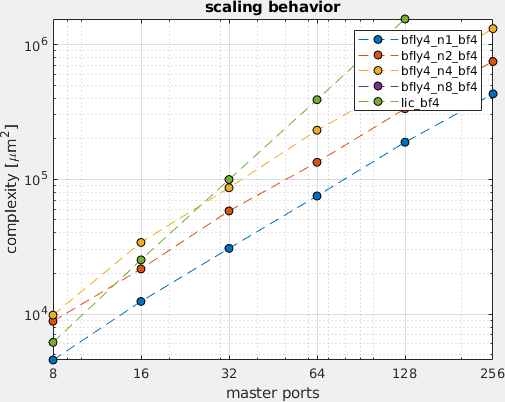

